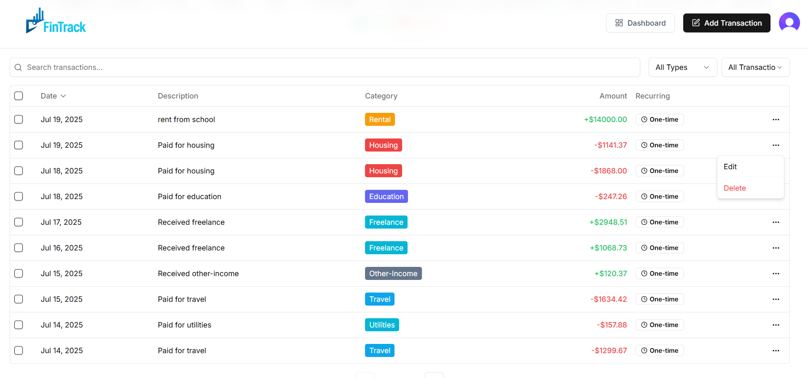
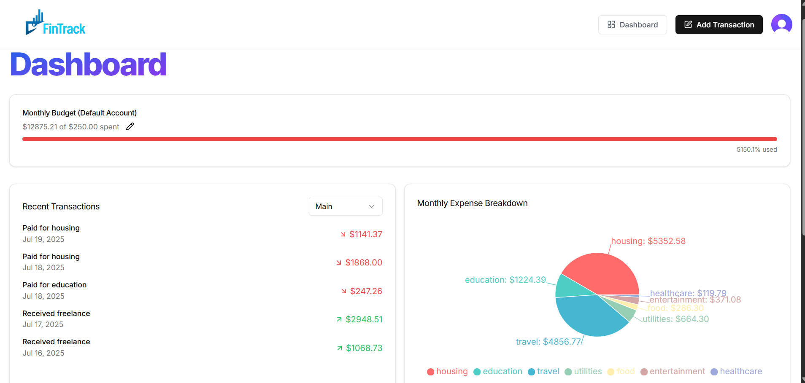
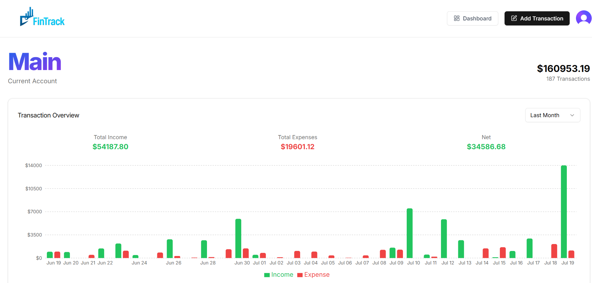

# 📊 FinTrack - Personal Finance Visualizer

FinTrack is a sleek, AI-assisted personal finance visualization platform built using modern web technologies. It helps users keep track of transactions, visualize spending patterns, and make data-driven decisions.


---

## 🚀 Features

* 🔐 **Clerk Auth Integration** - secure user authentication & role management.
* 🧾 **Transaction Management** - easily add and track your expenses.
* 📅 **Monthly Expense Breakdown** - visual charts to analyze your monthly spending.
* 📈 **Transaction Overview Graph** - high-level visualization of your financial activity.
* 💡 **AI Integration (Gemini)** - get insights, suggestions, and generate summaries.
* 📧 **Email Notifications** - automated emails using EmailJS.
* 📊 **Real-Time Charts** - powered by Recharts for stunning visuals.
* ☁️ **Deployed using Vercel** with PostgreSQL hosted on Supabase.

---

## 🛠️ Tech Stack

<p align="left">
  
  
  
  
  
</p>

---

## 🧪 Demo Screenshots

### 📋 Transaction List



### 📆 Monthly Expense Breakdown



### 📊 Transaction Overview Graph



---

## 📦 Dependencies (key highlights)

* **Next.js 15** with **Turbopack**
* **Prisma ORM**
* **Clerk for Auth**
* **Recharts** & **React Spinners**
* **Radix UI** + **ShadCN-UI-style components**
* **Zod** & **React Hook Form** for form validation
* **Tailwind CSS** + **tailwind-merge** + **tailwindcss-animate**
* **Gemini AI API** for intelligent finance insights
* **EmailJS** + **Resend** for automated emails
* **Arcjet** for edge protection

---

## 📁 .env Configuration (Required)

Create a `.env` file in the root directory with the following keys:

```
NEXT_PUBLIC_CLERK_PUBLISHABLE_KEY=
CLERK_SECRET_KEY=
NEXT_PUBLIC_CLERK_SIGN_IN_URL=
NEXT_PUBLIC_CLERK_SIGN_UP_URL=

DATABASE_URL=
DIRECT_URL=

ARCJET_KEY=
RESEND_API_KEY=
GEMINI_API_KEY=

NEXT_PUBLIC_EMAILJS_SERVICE_ID=
NEXT_PUBLIC_EMAILJS_TEMPLATE_ID=
NEXT_PUBLIC_EMAILJS_PUBLIC_KEY=
```

> ⚠️ **Important:** Never commit your real `.env` values to GitHub. Keep your secrets secure.

---

## 🧑‍💻 Getting Started

```bash
git clone https://github.com/your-username/fintrack.git
cd fintrack
npm install
npm run dev
```

---

## 📬 Contributing

If you find a bug or have a feature request, feel free to open an issue or submit a pull request. Contributions are always welcome!

---

## 📝 License

MIT License © 2025 \[Sundram Mishra]
